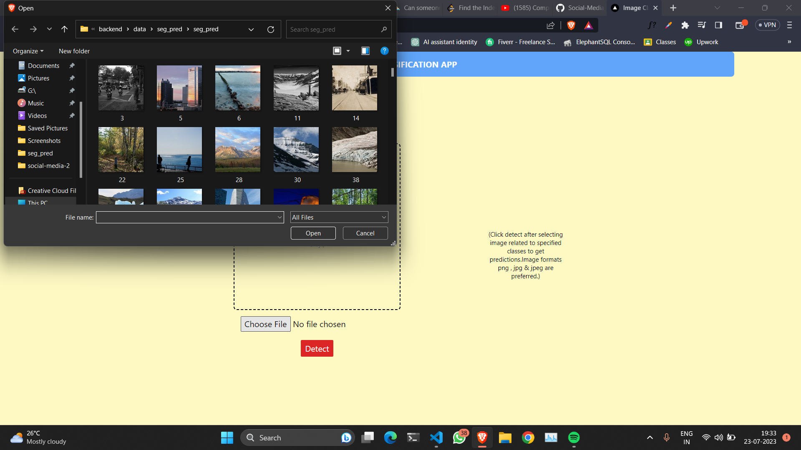

### About

Here, I've implemented Full-Stack Multi-Class Image Classification in PyTorch.
We've used the following Tech Stack:

- Frontend: NextJS + TailwindCSS,
- Backend: FastAPI,
- ML Algorithm: CNN,

### How to use

Install all the dependencies using:

First go to backend > server:

```bash
pip install -r requirements.txt
```

```bash
uvicorn main:app --reload
```

Then go to client:

```bash
yarn
```

```bash
yarn dev
```

Some previews





